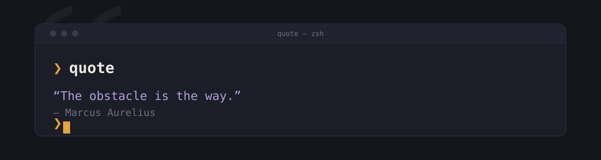

<p align="center">
  
</p>

<h1 align="center">quote</h1>
<p align="center">A terminal quote collector. Pulls from <a href="https://zenquotes.io">ZenQuotes</a>, caches locally, and keeps a personal collection you build over time.</p>

<p align="center">
  
  
  
  
</p>

---

## Features

- 🔁 Pulls quotes from ZenQuotes in batches of 50 and caches them locally — most runs never touch the network
- 💾 `--save` keeps the last quote you saw, checked against duplicates before it's written
- ✍️ `--add` lets you type in your own quotes
- 🗑️ `--remove` opens a picker to delete a quote from your collection — add `--filter` to search by author or text first instead of scrolling through everything
- 🎲 `--random` pulls a random quote from your personal collection
- 📦 No config, no server, no accounts — one command, one local folder

## Install

Requires [Python 3.8+](https://www.python.org/downloads/) and [pipx](https://pipx.pypa.io/latest/how-to/install-pipx.html).

```
pipx install git+https://github.com/anirudhkottayil/Quotes.git
```

## Usage

```
quote                       # show a quote
quote --save                # save the last quote you saw
quote --add                 # add your own quote
quote --random              # show a random quote from your saved collection
quote --remove              # pick a quote to delete
quote --remove --filter     # search first, then pick a quote to delete
```

## How it works

Quotes come from ZenQuotes' batch endpoint, 50 at a time, stored locally as JSONL. Each run pops one from the cache; when it runs out, `quote` quietly refetches in the background. Anything you save goes into a separate personal file, checked against what's already there so nothing gets duplicated.

`--remove` opens an interactive picker over that personal file — scroll with the arrow keys or j/k, enter to delete. `--filter` asks for an author or a bit of quote text first, so you're choosing from a few matches instead of paging through your whole collection.

## Data

Everything lives in `~/.local/share/quotes/` — your saved quotes, the local cache, nothing else. Delete the folder any time to start clean.
